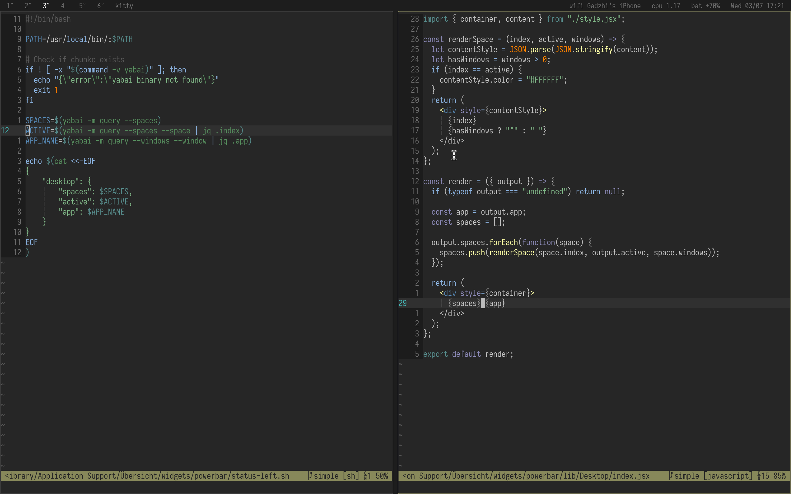

# nibar

Simple [Übersicht](https://github.com/felixhageloh/uebersicht) widget status bar with [yabai](https://github.com/koekeishiya/yabai) support.

Originally forked from https://github.com/ajdnik/powerbar. I made it work with yabai and tweaked the aesthetics to match my preference.

## Screenshot



## Installation

Clone this repo to your Übersicht widgets directory.

```bash
$ git clone https://github.com/kkga/nibar $HOME/Library/Application\ Support/Übersicht/widgets/nibar
```

## Dependencies

- [jq](https://github.com/stedolan/jq) — used for parsing json output and displaying the workspaces widget
    - install with homebrew: `brew install jq`
- [SF Fonts](https://developer.apple.com/fonts/) (optional) — used for symbols in the statusbar widget

## Usage

### Yabai workspaces widgets

There are 2 widgets for displaying workspaces: `spaces-primary` and `spaces-secondary`. The `spaces-secondary` is used when working with dual displays.
If you're using a single display, disable it in the Übersicht's menu.

### Refreshing yabai workspaces widget

The widgets for displaying yabai workspaces aren't refreshing automatically (to preserve battery). To refresh them, you can add these lines utilizing [yabai's signals](https://github.com/koekeishiya/yabai/wiki/Commands#automation-with-rules-and-signals) at the end of `.yabairc`:

#### When using a single display

```sh
yabai -m signal --add event=space_changed \
    action="osascript -e 'tell application \"Übersicht\" to refresh widget id \"nibar-spaces-primary-jsx\"'"
```

#### When using dual displays

```sh
yabai -m signal --add event=space_changed \
    action="osascript -e 'tell application \"Übersicht\" to refresh widget id \"nibar-spaces-primary-jsx\"'"
yabai -m signal --add event=display_changed \
    action="osascript -e 'tell application \"Übersicht\" to refresh widget id \"nibar-spaces-primary-jsx\"'"

yabai -m signal --add event=space_changed \
    action="osascript -e 'tell application \"Übersicht\" to refresh widget id \"nibar-spaces-secondary-jsx\"'"
yabai -m signal --add event=display_changed \
    action="osascript -e 'tell application \"Übersicht\" to refresh widget id \"nibar-spaces-secondary-jsx\"'"
```


